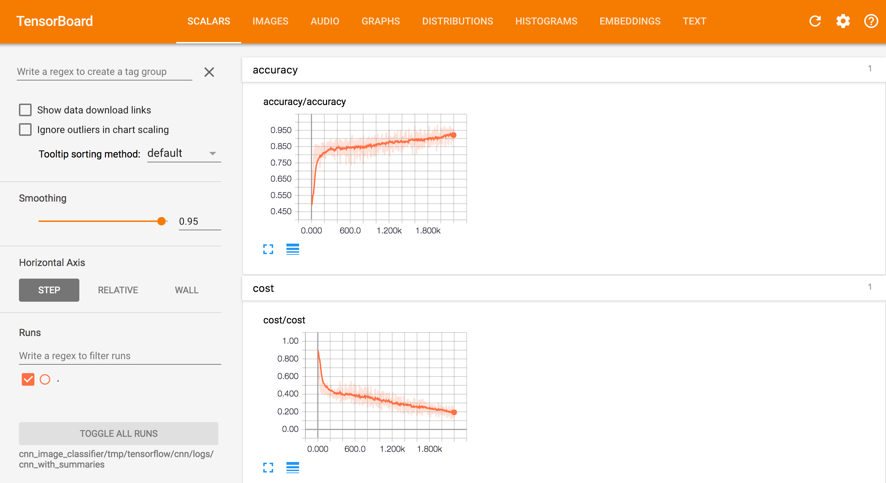
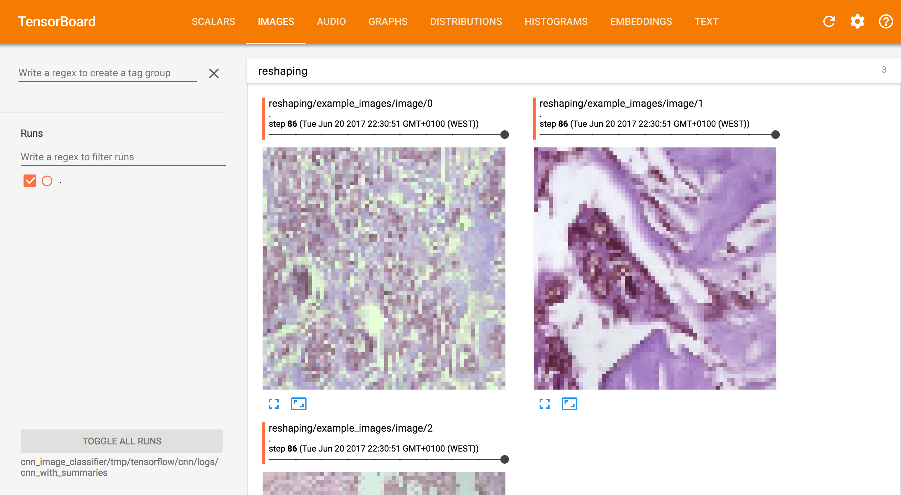
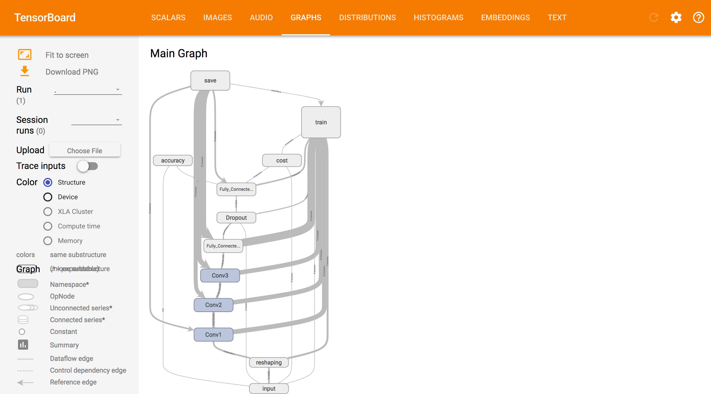
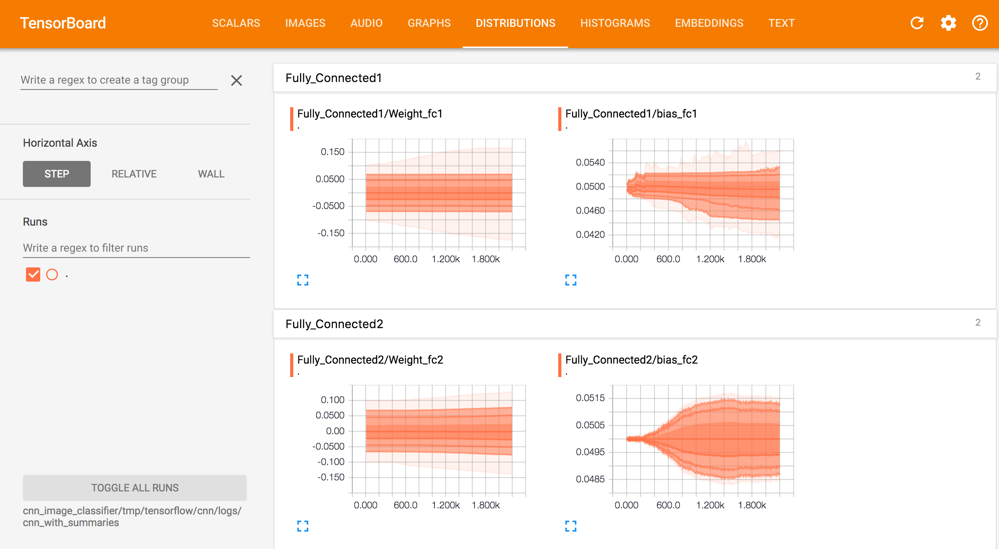
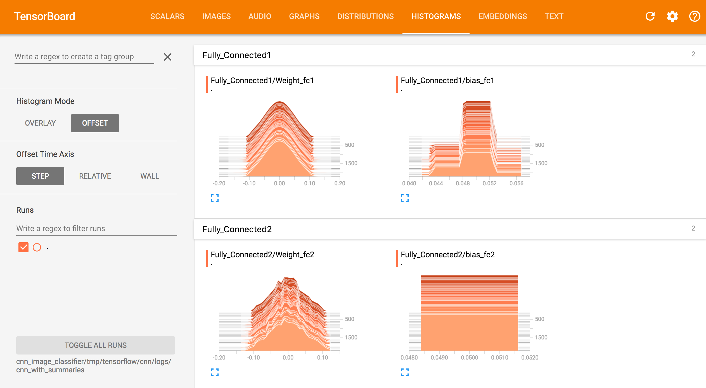

# DNN Cancer Classifier

This section demonstrates a Convolutional Neural Network implementation to
classify breast cancer tumours as benign or malignant depending on
histopathological images.

## Usage

1. Change directory to the dnn module:
    ```
    $ cd cnn_image_classifier
    ```

2. Run the application:
    ```
    $ python main.py

    Would you like to train (1) the model or use it for a prediction (2):
    ```
    The applicaiton starts with a user prompt to either train the model or
    use it for a prediction (see relevant sections below).

### Training

 Selecting 1 will train the model either from scratch or to carry on training
 an existing model (if one exists) with new epochs. Here we demonstrate a
 completely clean run, where any existing model is removed and a new model
 is trained from scratch.  As with the dnn classifier, the parameters for
 training (epochs, steps, model directory, etc) can be altered in
 cnn_data_classifier/main.py and cnn_data_classifier/cnn_model.py.
 The expected output should be:

```
Would you like to train (1) the model or use it for a prediction (2): 1
Destroy existing resources and train from scratch (WARNING: this is memory intensive and may take considerable time)? Enter Y/N: y
INFO:root:Removing resource: Directory [classifying-cancer/cnn_image_classifier/tmp].
INFO:root:Removing resource: Directory [classifying-cancer/cnn_image_classifier/images].
INFO:root:Extracting archive BreaKHis_v1.tar.gz to classifying-cancer/cnn_image_classifier/BreaKHis_v1
INFO:root:Creating resource: Directory [classifying-cancer/cnn_image_classifier/images/train/benign]
INFO:root:Creating resource: Directory [classifying-cancer/cnn_image_classifier/images/train/malignant]
INFO:root:Creating resource: Directory [classifying-cancer/cnn_image_classifier/images/predict/benign]
INFO:root:Creating resource: Directory [classifying-cancer/cnn_image_classifier/images/predict/malignant]
INFO:root:Removing resource: Directory [classifying-cancer/cnn_image_classifier/BreaKHis_v1].
INFO:root:Loading resource: Images [classifying-cancer/cnn_image_classifier/images/train]
WARNING:root:Resource not found: CNN Model [classifying-cancer/cnn_image_classifier/tmp/tensorflow/cnn/model/model.ckpt]. Model will now be trained from scratch.
INFO:root:Epoch 0 --- Accuracy:  88.3%, Validation Loss: 0.405
INFO:root:Epoch 5 --- Accuracy:  89.8%, Validation Loss: 0.288
INFO:root:Epoch 10 --- Accuracy:  88.3%, Validation Loss: 0.302
INFO:root:Epoch 15 --- Accuracy:  85.9%, Validation Loss: 0.313
INFO:root:Epoch 20 --- Accuracy:  89.1%, Validation Loss: 0.288
INFO:root:Epoch 25 --- Accuracy:  89.8%, Validation Loss: 0.284
INFO:root:Epoch 30 --- Accuracy:  89.1%, Validation Loss: 0.264
INFO:root:Epoch 35 --- Accuracy:  89.8%, Validation Loss: 0.254
INFO:root:Epoch 40 --- Accuracy:  90.6%, Validation Loss: 0.247
INFO:root:Epoch 45 --- Accuracy:  89.8%, Validation Loss: 0.220
```

*(Optional)*: As this process can take a long time depending on local
resources of the CPU/GPU it can be helpful to visualise the training
rate, accuracy, and cost.  This can be achieved using TensorBoard,
which comes packed with TensorFlow.  To activate TensorBoard run:

```
tensorboard --logdir=cnn_image_classifier/tmp/tensorflow/cnn/logs/cnn_with_summaries
```

Note: this is the default log directory as defined in main.py, by
the model_dir property.

TensorBoard can now be accessed via a web browser at 127.0.0.1:6006
where a number of metrics can be observed:
* Scalars: interactive graphs to analyse the accuracy and validation
loss/cost of the model.

    

* Images: displays images currently being processed, reshaped to 64x64 pixels.

    

* Graphs: interactive graph to explore the cnn model architecture

    

* Distributions: interactive graphs to analyse the distributions of
weights and biases in the fully connected layers.

    

* Histograms: interactive graphs to analyse the percentiles of weights
and biases in fully connected layers.

    

With the model trained we can either re-run, this time selecting N when prompted
for a clean run, to further train the model and increase accuracy, or use it for
a prediction.

### Prediction

With a trained model we can now use it to classify histopathological images. As this
is a PoC we currently only support images from the same source - the BreakHis database.
During the initial set up with a clean training run we partition the images into
training, and predict directories.  Training data is then randomly sampled into Train
and Test datasets for the model to learn and evaluate itself against, whilst images in
the predict directory are kept isolated from the model - they are completely unseen to
it. We can then pass a random image from this directory to the trained model for it to
try and predict the classification of the image.  We also return the true classification
of this image back to the user as we can derive it from the filepath, as so:

```
Would you like to train (1) the model or use it for a prediction (2): 2
We will now randomly select an image from our prediction set (previously unseen by our model).
INFO:root:Loading resource: Images [classifying-cancer/cnn_image_classifier/images/predict]
INFO:tensorflow:Restoring parameters from classifying-cancer/cnn_image_classifier/tmp/tensorflow/cnn/model/model.ckpt
INFO:tensorflow:Restoring parameters from classifying-cancer/cnn_image_classifier/tmp/tensorflow/cnn/model/model.ckpt
Prediction: This is a benign cell.
Validation: It was a benign cell
```

Here we see that the model has correctly predicted a benign image, however we know
from our training that the model is only about 90% accurate.  By repeating our training
we could easily increase the accuracy higher, as at 90% accuracy we may see some
incorrect predictions.
